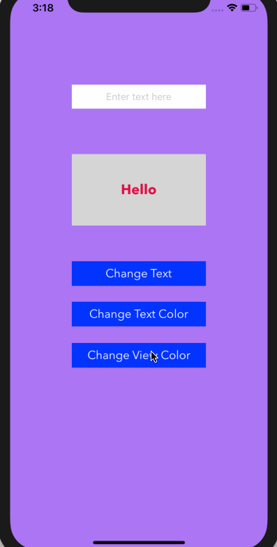
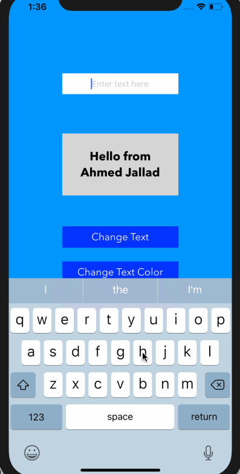
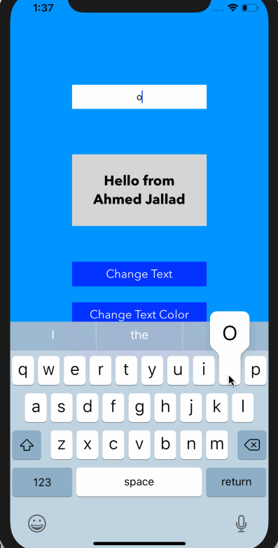

## CodePathApp

### App Description
This app is a basic demonstration of numerous key features most apps utilize such as user interactions with buttons, the view, as well as the keyboard. The application not only portrays these features intuitively, but it is also very lively by its ability to augment the colors of the view and the text color. 

### App Walk-though
-This part of the application shows how the user is able to change the color of the view as well as go back to the default color by clicking anywhere on the view.

-This part of the app displays how the user is able to change the text as well as change the color of the text.

-This part of the app shows how the user is able to go back to all default settings by clicking anywhere on the view

### Required User Stories
- [x] 1. User sees custom text in a label - Hello from {name}!
- [x] 2. User see's custom background color.
- [x] 3. User can tap a button to change the text color of the label.

### Optional User Stories
- [x] 1. User can tap a button to change the color of the background view.
- [x] 2. User can tap a button to change the text string of the label - Goodbye 👋.
- [x] 3. User can tap on the background view to reset all views to default settings.
- [x] 4. User can update the label text with custom text entered into the text field.
   - [x] a. User can enter text into a text field using the keyboard.
   - [x] b. User can tap the "Change text string" button to update the label with the text from the text field.
   - [x] c. If the text field is empty, update label with default text string.
   - [x] d. The keyboard is dismissed after the button has been tapped.